

  
  #  Python Analytics 

### EDA → Business Analytics → Interactive Dashboards & ML

⭐ from foundational EDA and data storytelling to production-style dashboards, geospatial analytics, and predictive modeling.

---

## Portfolio Overview

| Level | Project | Key Focus | Skills Demonstrated |
|:---:|---|---|---|
|  🟢**Beginner**  | **Netflix Analytics Dashboard** | EDA & Visualization | Data Cleaning, EDA, Trend Analysis, Storytelling |
| 🟡**Intermediate** | **Customer Churn Analytics** | Customer Behavior & Business Insights | Segmentation, Correlation Analysis, Business Analytics |
|  🔵**Advanced**  | **Aviation Intelligence Dashboard** | Interactive Analytics Platform + ML | Streamlit, KPI Design, Geospatial Analytics, ML |

---
## Core Competencies

| Analytics | Visualization | Dashboard Development | Machine Learning |
|------------|------------|------------|------------|
| Data Cleaning | Matplotlib | Streamlit | Predictive Modeling |
| Feature Engineering | Seaborn | Interactive Analytics | Feature Importance |
| KPI Development | Plotly | Business Reporting | Model Deployment |
| Exploratory Analysis | Data Storytelling | Dashboard UX | Model Evaluation |
---

## Portfolio Showcase

| 🟢 Beginner | 🟡 Intermediate  | 🔵 Advanced  |
|---|---|---|
|  | 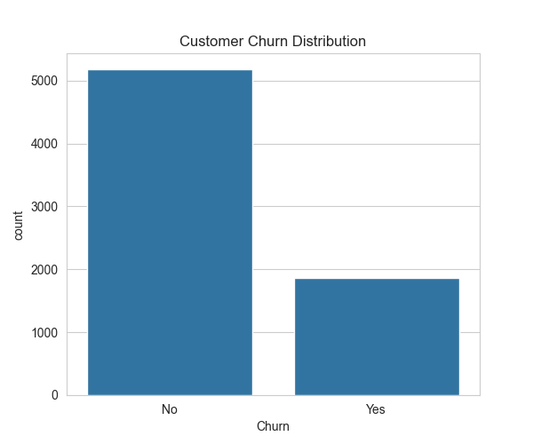 | 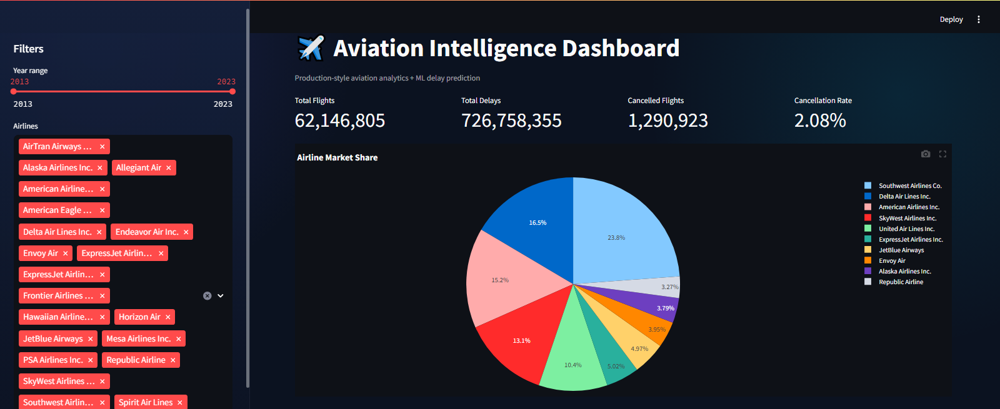 |
| Movies vs TV Shows Distribution | Customer Churn Breakdown | Interactive KPI Dashboard & Filters |
| 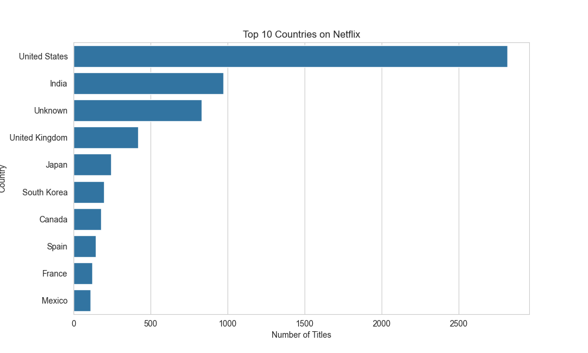 | 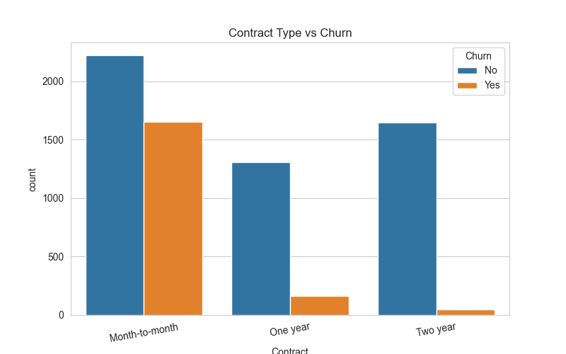 | 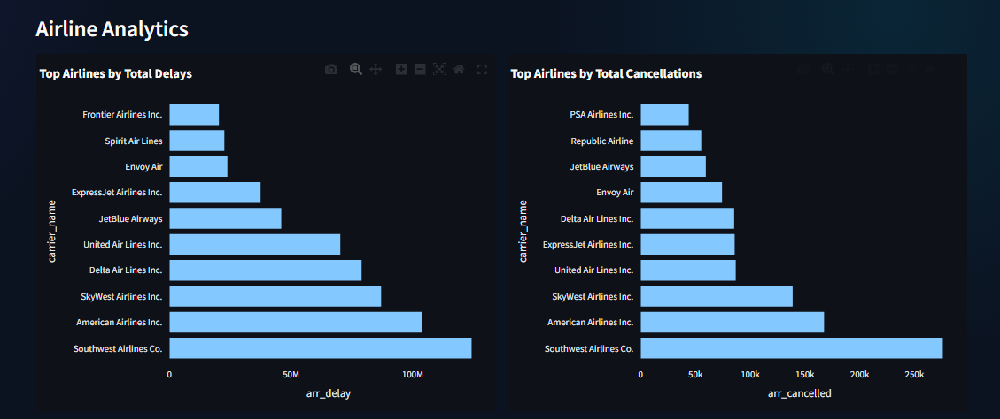 |
| Top Content-Producing Countries | Contract Type Impact on Churn | Airline Delay & Cancellation Analytics |
| 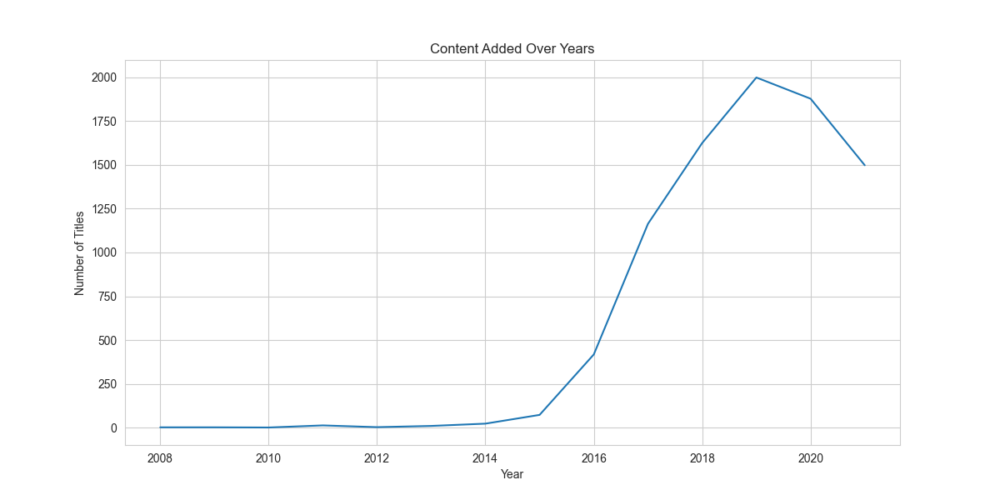 | 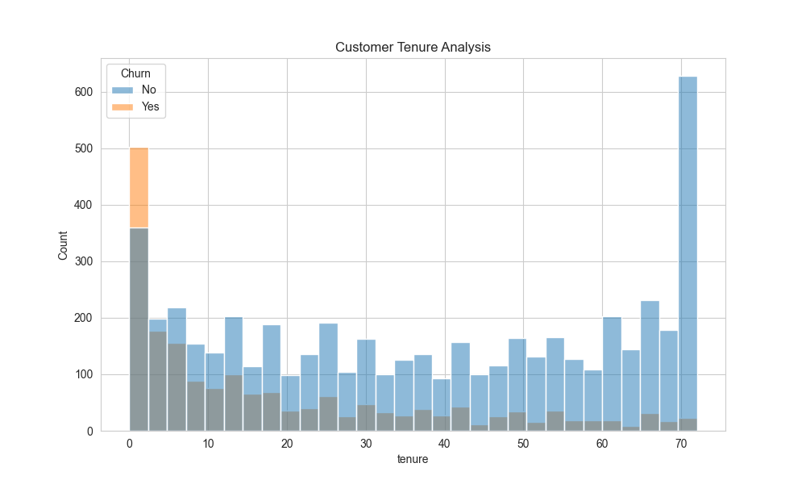 | 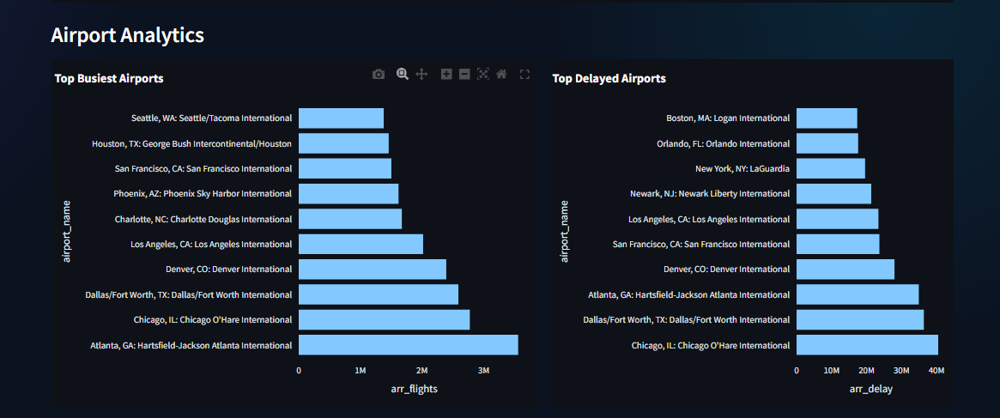 |
| Netflix Content Growth Over Time | Customer Loyalty & Retention Analysis | Airport Traffic & Delay Intelligence |
| 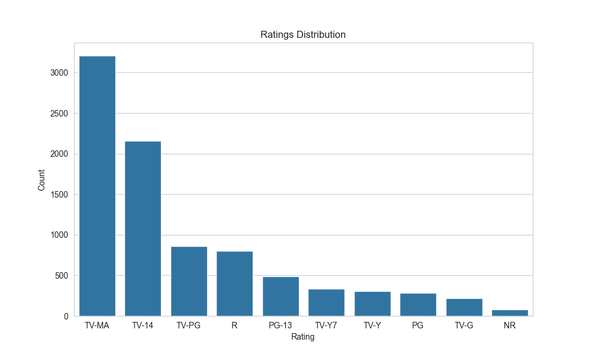 | 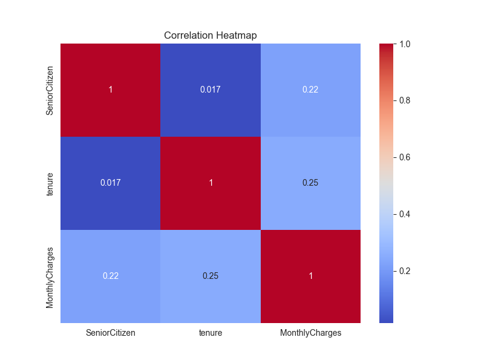 | 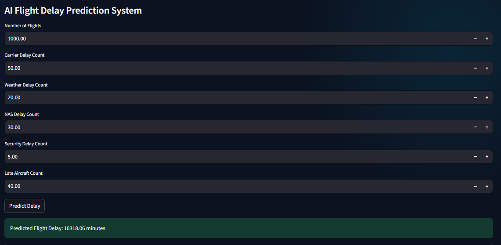 |
| Audience Rating Distribution | Feature Correlation Analysis | ML-Powered Flight Delay Prediction |

---

## Skills Demonstrated

| Category | Skills |
|---|---|
| Data Skills | Data cleaning, aggregation, correlations, KPI computation |
| Visualization | Matplotlib/Seaborn, Plotly charts, dashboard-ready storytelling |
| Dashboard Focus | Filterable UX, structured layout, modular chart generation |
| ML (Advanced) | Feature selection, model training workflow, artifact-based inference |
| Engineering Tone | Reproducible workflows, clear folder structure, maintainable code |

---

## Tools & Technologies Used

- **Python** 🐍
- **Pandas**
- **Matplotlib**
- **Seaborn**
- **Plotly** 📈
- **Streamlit** (Advanced dashboard)
- **Folium** 🗺️ (geospatial map)
- **scikit-learn** (ML)
- **joblib** (model persistence)

---

##  Portfolio Projects

### 🟢 Beginner — Netflix Analytics Dashboard

**EDA project exploring Netflix content trends through visual analytics.** 

**Highlights:**
- Movies vs TV Shows
- Ratings Analysis
- Content Growth
- Country Insights

**learnings**
- Strong fundamentals: cleaning, transformation, and clear EDA storytelling.
- communicate insights with visuals.

---

### 🟡 Intermediate — Customer Churn Analytics 

**Business-focused analytics project identifying customer churn patterns.** 

**Highlights:**
- Churn Drivers 
- Contract Analysis
- Customer Retention 
- Correlation Insights

**learnings:**
- Business analytics thinking (customer churn is inherently actionable).
- Clear use of segmentation + correlations to support interpretation.

---

### 🔵 Advanced — Aviation Intelligence Dashboard 

**Production-style Streamlit dashboard combining analytics, visualization, and machine learning.** 

**Core capabilities:**
- Interactive KPIs (flights, delays, cancellations, cancellation rate)
- Airline intelligence 
- Airport intelligence
- Monthly × yearly heatmaps
- Weather-related delay insights + correlation views
- Folium-based interactive airport map
- Embedded ML prediction: **arrival delay (minutes)**

**ML details :**
- Model: **RandomForestRegressor**
- Training workflow: offline training + saved artifact loading
- In-dashboard prediction: safe inference UX with input coercion

**learnings:**
- Analytics → visuals → dashboard UX → ML integration

---

## ⭐ Quick Start (Repository Navigation)

- `python-basic/Netflix-Analytics/`
- `python-intermediate/Customer-Churn-Analytics/`
- `python-advanced/Aviation-Intelligence-Dashboard/`

---

## 📬 Contact

**Maitreyee Rane**

📧 maitreyeenrane@gmail.com

⭐ Continuously learning, building, and improving.

---
