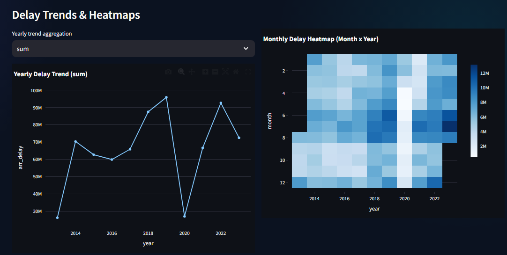
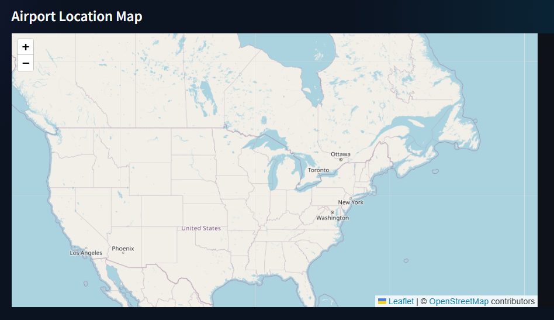
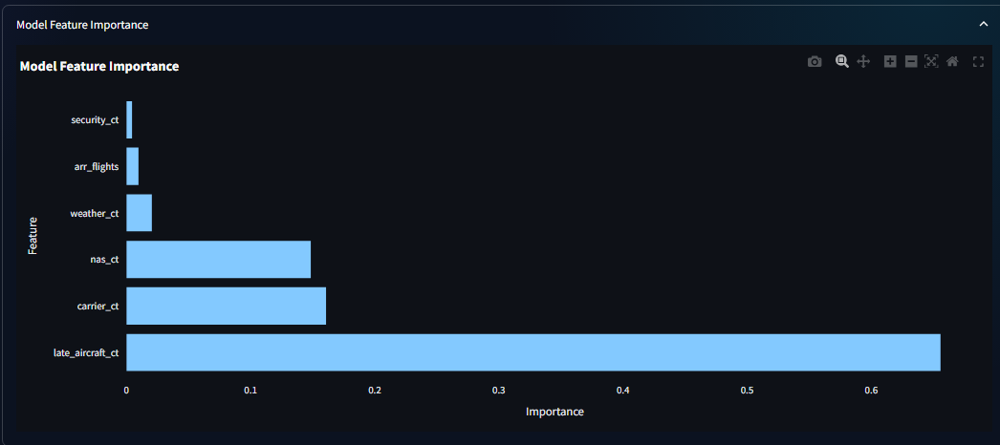
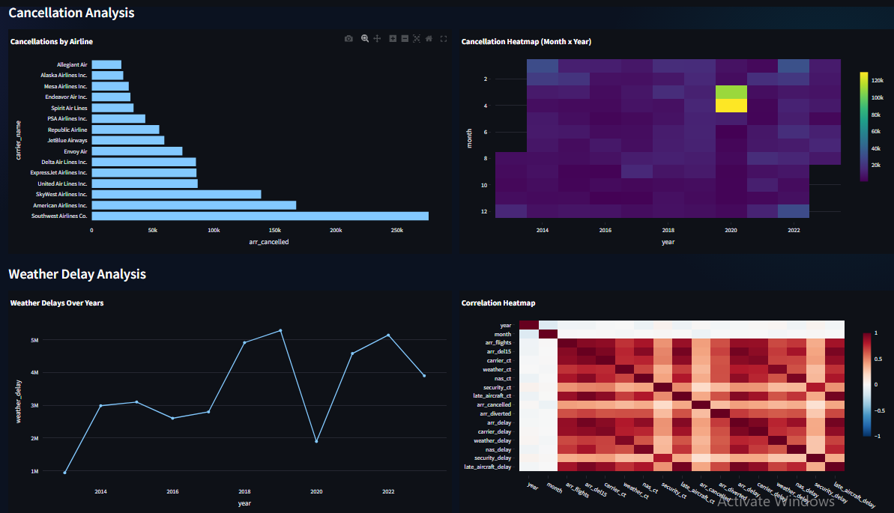

# ✈️ Aviation Intelligence Dashboard 

> **Recruiter-ready portfolio project**: production-style Python analytics + an embedded ML prediction system for operational delay intelligence.


## Project Overview
The **Aviation Intelligence Dashboard** is a modern Streamlit application that helps aviation operators, analysts, and decision-makers answer high-impact questions:
- **Which airlines and airports drive the most delays/cancellations?**
- **How have delay and cancellation patterns changed over time?**
- **Where do weather-related impacts show correlation with delay volume?**
- **What is the predicted arrival delay** given scenario-based operational inputs?

It combines:
- **Advanced operational analytics** (KPI cards, leaderboards, trend lines, heatmaps)
- **Interactive geospatial visualization** (Folium airport map)
- **An end-to-end ML system** (trained offline, used live in the dashboard)

---

## Dashboard Showcase

| Dashboard Overview | Airline Analytics |
|---|---|
|  |  |
| Interactive KPI dashboard with filters and operational metrics. | Airline delays, cancellations, and market share analysis. |

| Airport Analytics | Delay Trends & Heatmaps |
|---|---|
|  |  |
| Airport traffic and delay intelligence. | Yearly trends and seasonal delay patterns. |

| Airport Intelligence Map | Flight Delay Prediction |
|---|---|
|  |  |
| Interactive geospatial airport visualization. | Machine learning-powered arrival delay prediction. |

| Feature Importance Analysis | Additional Analytics |
|---|---|
|  |  |
| Key factors influencing model predictions. | Weather impacts, cancellations, and supporting insights. |

---

## 🌟Project Highlights

- End-to-End Analytics Engineering
- Interactive Dashboard Development
- Geospatial Visualization
- Machine Learning Integration
- Production-Oriented Project Structure

---

## Key Features

- 📊 Interactive KPI Dashboard
- 🏆 Airline Performance Analytics
- 🛬 Airport Intelligence
- 📈 Delay & Cancellation Trends
- 🌡️ Monthly × Yearly Heatmaps
- 🌦️ Weather Impact Analysis
- 🗺️ Interactive Airport Mapping
- 🤖 Arrival Delay Prediction System
- 🔍 Feature Importance Visualization

---

## 📈 Analytics Capabilities
### Airline Analytics
- **Top airlines by total arrival delay** (`arr_delay` aggregated by `carrier_name`)
- **Top airlines by total cancellations** (`arr_cancelled` aggregated by `carrier_name`)
- **Market share view** based on total flights per airline

### Airport Analytics
- **Busiest airports** by total arrival flights
- **Most delayed airports** by total arrival delays

### Trend & Heatmap Analytics
- **Yearly delay trend** — configurable aggregation (`sum` or `avg`)
- **Monthly × Year delay heatmap** — surfaces seasonality and operational volatility

### Cancellation Analytics
- **Cancellations by airline**
- **Cancellation time heatmap** — year × month patterns for operational planning

### Weather Delay Analytics
- **Weather delays over years** (from `weather_delay` if present, otherwise `weather_ct`)
- **Correlation heatmap** across numeric features to support root-cause exploration

---

## 🤖 Machine Learning

| Component | Details |
|------------|------------|
| Model | Random Forest Regressor |
| Input Features | Flight Volume, Carrier, Weather, NAS, Security & Late Aircraft Delays |
| Output | Predicted Arrival Delay (Minutes) |
| Deployment | Embedded Directly Inside Streamlit Dashboard |

---

## 🧾 KPI Highlights (Live Metrics)
Depending on the selected filters, the dashboard updates:
- **Total Flights** (sum of `arr_flights`)
- **Total Delays** (sum of `arr_delay`)
- **Cancelled Flights** (sum of `arr_cancelled`)
- **Cancellation Rate** (`arr_cancelled / arr_flights`)

---

## 🗺️ Interactive Maps (Airport Intelligence)
The dashboard renders an interactive **Folium** map embedded in Streamlit.
- Markers are created from airport-level rows
- The map is **dataset-driven**:
  - If the dataset contains `lat`/`lon` (or compatible column names like `latitude`/`longitude`), markers are shown
  - If lat/lon are missing, the app still loads with a safe default map view

---

##  Tech Stack

**Python • Pandas • Plotly • Streamlit • Folium • Scikit-Learn • Joblib • Seaborn**

---

## 📁 Folder Structure
```text
Aviation-Intelligence-Dashboard/
  app.py
  prediction_model.py
  README.md
  requirements.txt
  TODO.md

  dataset/
    flights.csv

  models/
    delay_prediction_model.pkl

  plots/
    (generated plots & heatmaps)

  src/
    data.py
    analytics.py
    charts.py
    prediction.py
```

---

## Business Insights

- Identify high-delay airlines and airports
- Monitor operational performance trends
- Analyze weather-related impacts
- Detect seasonal delay patterns
- Simulate operational scenarios using ML predictions

---

### Thank You for Visiting!!

This project showcases the integration of analytics, dashboard engineering, and ML to solve real-world aviation operational challenges.

⭐ continuously learning, building, and improving.
