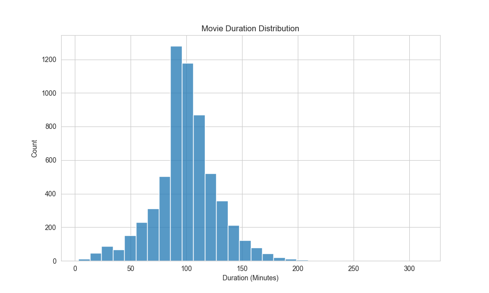

# Netflix Analytics Dashboard

## Overview

This project explores Netflix content data through exploratory data analysis (EDA) and visual storytelling. The objective is to uncover patterns in content distribution, ratings, duration, and growth over time.

---

## Dashboard Visualizations

| Visualization | Description |
|--------------|-------------|
|  | **🎬 Movies vs TV Shows Distribution**  Shows the proportion of Movies and TV Shows available on Netflix.  **Insight:** Helps understand the platform's content strategy and media mix. |
|  | **🌍 Top Countries by Content Volume**  Displays the countries contributing the highest number of titles.  **Insight:** Identifies major content-producing regions on Netflix. |
|  | **⭐ Ratings Distribution**  Visualizes content ratings across the platform.  **Insight:** Reveals target audience demographics and content maturity levels. |
|  | **📅 Content Added Over Time**  Tracks how Netflix content additions have changed over the years.  **Insight:** Highlights platform growth and acquisition trends. |
|  | **⏱️ Movie Duration Distribution**  Shows the distribution of movie runtimes.  **Insight:** Helps identify typical movie lengths and content preferences. |
|

---

## Skills 

- Data Cleaning
- Exploratory Data Analysis (EDA)
- Data Visualization
- Insight Generation
- Storytelling with Data

---

## Technologies Used

- Python
- Pandas
- Matplotlib
- Seaborn

---

## Project Outcome

This project demonstrates foundational analytics skills by transforming raw Netflix data into meaningful visual insights. It highlights the ability to clean data, explore trends, and communicate findings effectively through clear visualizations.

thanks for visitingg
