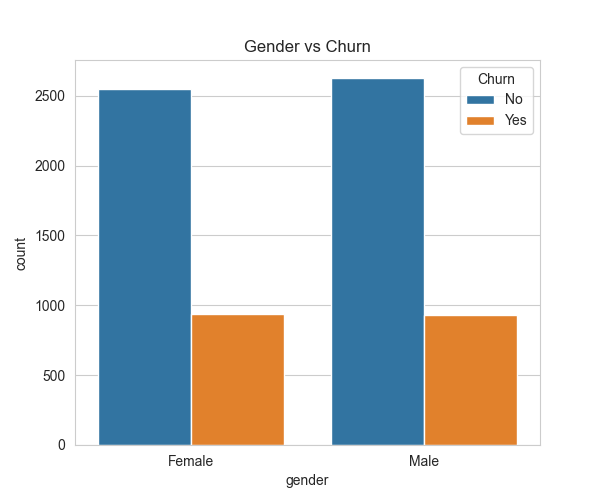
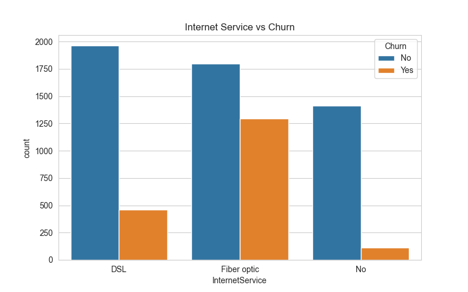
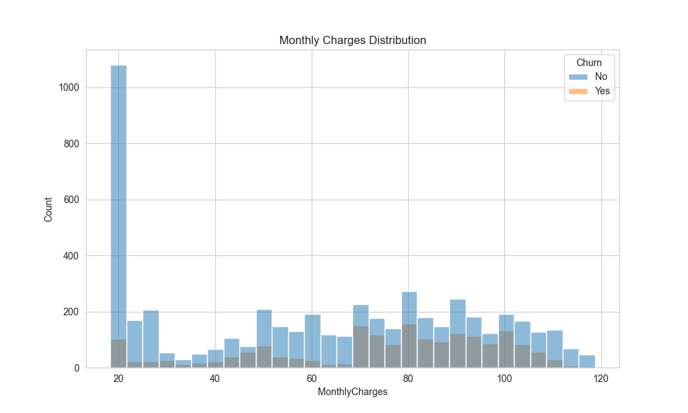
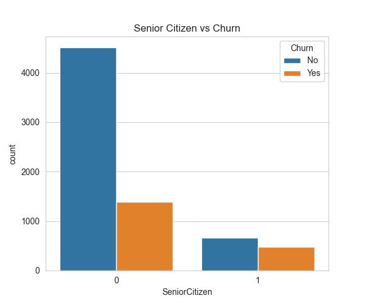

# 👤 Customer Churn Analytics Dashboard

## Overview

This project analyzes customer churn data to identify patterns, risk factors, and business insights that can help improve customer retention. Through exploratory data analysis and visualization, the project investigates how demographics, services, contracts, and billing characteristics relate to customer churn behavior.

---

## Dashboard Visualizations

| Visualization | Description |
|---------------|-------------|
|  | **📈 Churn Distribution**  Shows the proportion of customers who stayed versus those who churned.  **Insight:** Provides a quick overview of overall customer retention and churn rates. |
|  | **👤 Gender vs Churn**  Compares churn behavior across genders.  **Insight:** Helps determine whether gender significantly influences customer retention. |
|  | **📄 Contract Type vs Churn**  Analyzes churn rates across different contract types.  **Insight:** Reveals how contract commitments impact customer loyalty. |
|  | **🌐 Internet Service vs Churn**  Compares churn behavior among customers using different internet services.  **Insight:** Identifies service categories that may be associated with higher churn rates. |
|  | **💰 Monthly Charges vs Churn**  Examines the relationship between monthly charges and customer churn.  **Insight:** Helps evaluate whether pricing influences retention decisions. |
|  | **⏳ Customer Tenure Analysis**  Shows how churn varies with customer tenure.  **Insight:** Longer-tenure customers tend to exhibit greater loyalty and lower churn rates. |
|  | **👵 Senior Citizen vs Churn**  Compares churn behavior between senior citizens and non-senior customers.  **Insight:** Highlights demographic groups that may require targeted retention strategies. |
|  | **🔥 Correlation Heatmap**  Visualizes relationships between numerical variables in the dataset.  **Insight:** Helps identify factors that are most strongly associated with churn behavior. |

---

## Skills 

- Business Analytics
- Customer Segmentation
- Churn Analysis
- Correlation Analysis
- Data Visualization
- Insight Generation
- Exploratory Data Analysis (EDA)

---

## Tech used

- Python
- Pandas
- Matplotlib
- Seaborn

---

## Outcome

This project demonstrates practical business analytics skills by exploring customer behavior and identifying key drivers of churn. The analysis transforms raw customer data into actionable insights that can support customer retention strategies and data-driven decision-making.

thankyouu for visiting!!
